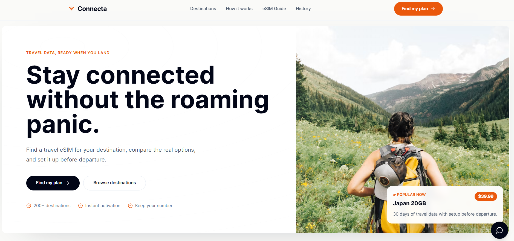
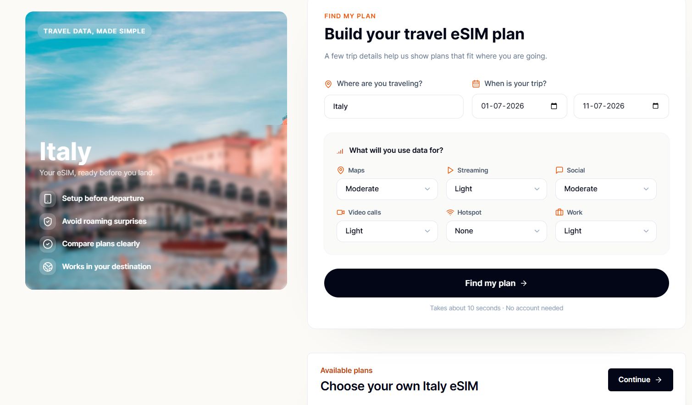
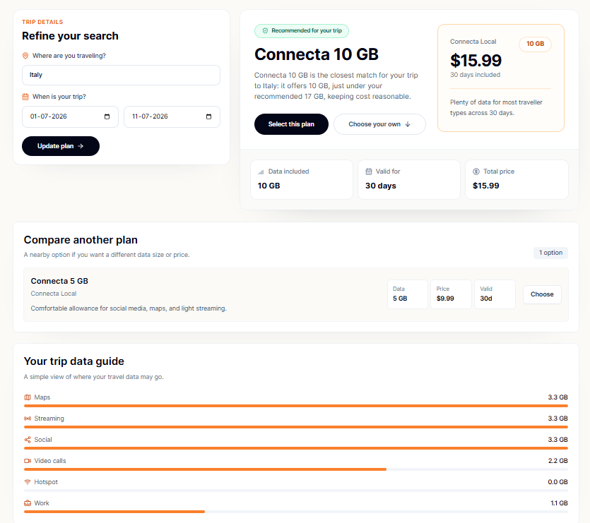
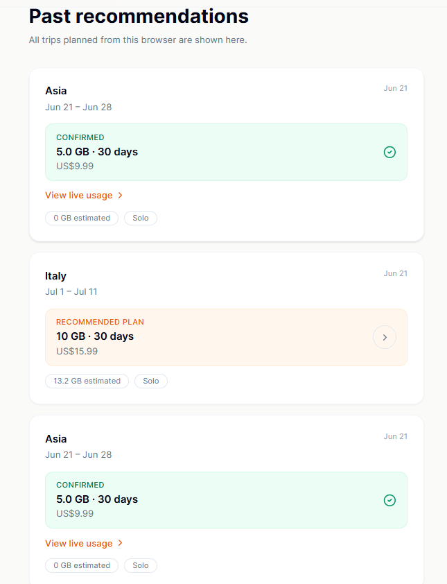
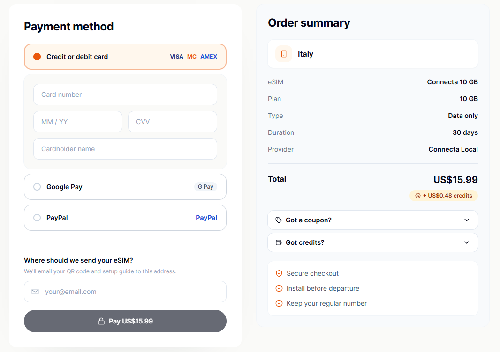

# Connecta

Connecta is a travel eSIM planner that recommends the right data plan from a user's destination, trip length, and usage habits. A deterministic Go/GraphQL backend estimates data needs and selects the plan; Groq can parse free-text trip descriptions or rewrite the explanation, but it never controls the final recommendation.

The system has two clients: a Next.js web app for planning and checkout, and **[SailGuard](https://github.com/trinayanswarup/SailGuard)**, a native Android companion app that tracks real mobile data usage every 30 seconds using Android's `TrafficStats` API. Confirmed plan selections and live usage snapshots sync through the same Postgres backend — so the web app shows a live usage chart from the phone.

**[Live Demo](https://connecta-frontend-one.vercel.app)** · **[Backend](https://connecta-eagq.onrender.com/graphql)** · **[Android App](https://github.com/trinayanswarup/SailGuard)**

> **Note:** The backend runs on Render's free tier and may take 30–60 seconds to wake up after inactivity. If the planner returns an error on first load, wait a moment and try again.

---

## Screenshots

<p align="center">
  
  
  
  
  
</p>

---

## Stack

|          |                                                   |
| -------- | ------------------------------------------------- |
| Frontend | Next.js 15 (App Router), TypeScript, Tailwind CSS |
| Backend  | Go, GraphQL (gqlgen)                              |
| AI       | Groq — `llama-3.3-70b-versatile`                  |
| Database | Supabase (Postgres + RLS)                         |
| Android  | Kotlin, Jetpack Compose (separate repo)           |
| Deploy   | Vercel (frontend) · Render (backend)              |

---

## Why AI doesn't choose the plan

Plan selection affects cost and user trust — so it's deterministic, not AI-driven. The recommendation engine always runs the same way: estimate GB from usage inputs, pick the cheapest plan that covers it with a 1.2× safety buffer. Groq is only used to parse free-text trip descriptions (chat mode) and rewrite the explanation text in natural language. If Groq fails or is unavailable, the same recommendation still works with deterministic fallback text. The product never breaks because an LLM call failed.

---

## Architecture

```
┌─────────────────────┐         ┌──────────────────────┐
│   Connecta (web)     │         │  SailGuard (Android)  │
│   Next.js · Groq      │         │  Kotlin · Compose     │
└────────┬────────────┘         └──────────┬────────────┘
         │                                  │
         └────────────┬─────────────────────┘
                      │
           ┌──────────▼───────────┐
           │   Go / GraphQL API    │
           │   gqlgen · pgx        │
           └──────────┬────────────┘
                      │
              ┌───────▼────────┐
              │  Supabase       │
              │  Postgres + RLS │
              └────────────────┘
```

### GraphQL surface

```graphql
# Recommendation
analyzeTrip(input: TripInput!): TripAnalysis!

# Checkout — works with or without an existing tripId.
# Android calls this without one (it has its own recommendation logic
# and never touches analyzeTrip). Web calls it with one.
confirmTrip(input: ConfirmTripInput!): Trip!

# Usage sync — Android pushes real TrafficStats readings every 30s.
# Web reads them to render a live chart on the trip detail page.
submitUsageSnapshot(input: SubmitUsageSnapshotInput!): UsageSnapshot!
tripUsage(tripId: ID!): [UsageSnapshot!]!

# Cross-client history — either client can see what the other confirmed.
tripsBySession(sessionId: String!): [Trip!]!
```

### Identity model

For the MVP, Connecta uses explicit session linking instead of user accounts. The web client generates a UUID stored in `localStorage`; pasting that UUID into SailGuard as a "link code" connects both clients to the same Postgres rows. This keeps the scope focused on the cross-client sync problem — which is the interesting engineering here — rather than on account management.

---

## Recommendation engine

```
UsageEstimator   →  GB/day estimate per activity, summed
PlanOptimizer    →  cheapest plan covering (estimated_gb × 1.2 buffer)
GroqEnhancer     →  rewrites explanation text only — optional, fallback-safe
TripRepository   →  upsert to Postgres; same path used by analyzeTrip and confirmTrip
```

Two input modes feed the same engine:

- **Form** — destination, dates, six usage sliders (streaming, video calls, hotspot, maps, social, work)
- **Chat** — free-text parsed by Groq into the same `TripInput` shape, then same backend call

---

## Running locally

```bash
# Backend
cd backend
cp .env.example .env
go run ./cmd/server

# Frontend
cd frontend
cp .env.example .env.local
npm install && npm run dev
```

`GROQ_API_KEY` is optional — the product never breaks without it.

---

## Repository layout

```
connecta/
  backend/
    cmd/server/          entry point
    graph/               schema.graphqls (source of truth), resolvers, gqlgen output
    agents/              UsageEstimator, PlanOptimizer
    internal/groq/       Groq client, always fallback-safe
    internal/plans/      global plan catalog (shared with the Android app)
    repositories/        Postgres + in-memory fallback
    services/            all orchestration — business logic lives here only
  frontend/
    app/                 planner, checkout, history, trip/[id] (live usage chart)
    components/          TripForm, CheckoutForm, TripDetail, PlannerExperience, etc.
    lib/                 graphql.ts, supabase.ts, session.ts
  supabase/
    schema.sql           full schema — original + SailGuard-integration migration
```

---

## Development notes

`CLAUDE.md` and `AGENTS.md` are excluded from this repository. They contain AI coding instructions, internal build quirks, and session-specific workflow notes used during active development with Claude Code. They are not useful to anyone reading the codebase and add noise without signal.
